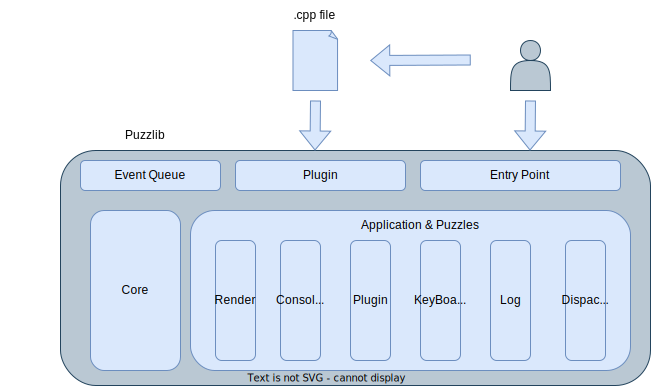
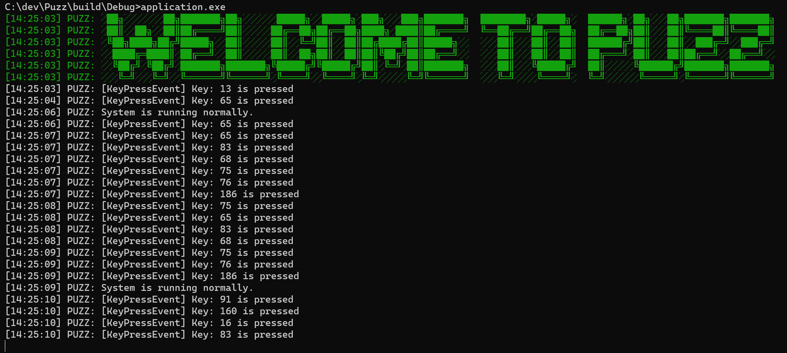
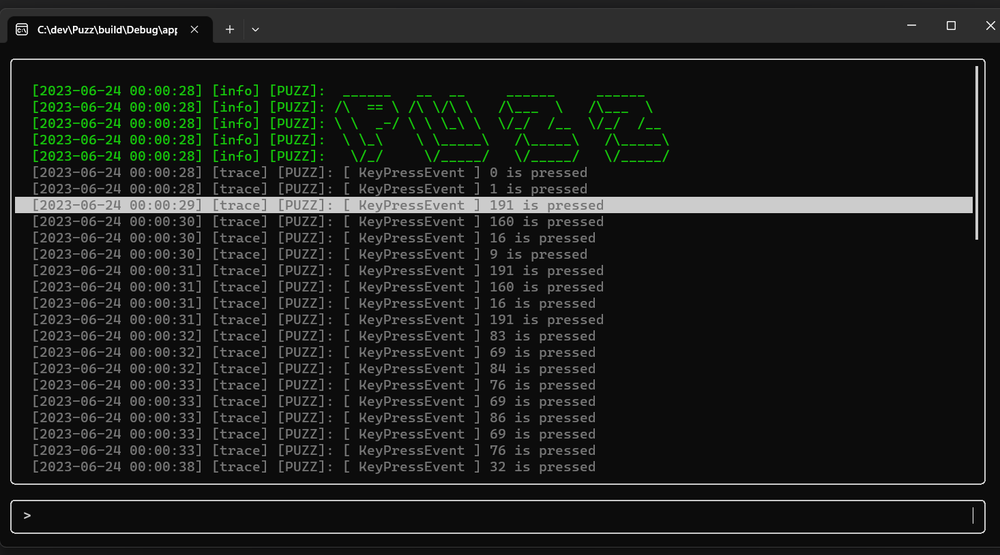

# Puzz


[中文]()

--------------------------------------------------------------------------------

Puzz is a side project designed for practicing and implementing software development concepts. It is created in the form of a software framework (or game engine), which facilitates the application of various design patterns and object-oriented concepts in the system architecture. For more information, please refer to the [Quick Guide](#Quick-Guide), where I've compiled some data on the development process.

A bit about the name: the project is called Puzz, inspired initially by the sense of assembling a puzzle when modularizing functionalities in the learning process. During development, the phrase "It's a C++ Puzz" popped up in my mind, and the name clicked. "Puzzle" also means a riddle or a problem, and for me, C++ development feels like solving various puzzles. I find the name quite poetic, LUL.

# Progress

- [X] Core System Architecture
- [X] Functional Modules
- [x] Rendering Support
- [X] 2D Physics Engine
- [X] Runtime Script System
- [X] GUI
- [ ] Implement a small game
- [ ] Cross-platform
- [ ] Testing
- [ ] Debug Tool
- [ ] Documentation
- [ ] Examples

# Table of Contents

* [Architecture](#Architecture)
* [Quick Guide](#Quick-Guide)
* [Getting Started](#Getting-Started)
    * [Dependencies](#Dependencies)
    * [Build Steps](#Build-Steps)

# Architecture

I use the diagram below to introduce the architecture and operation principle (perhaps I'll redraw it formally using UML one day).



Puzz is compiled into a Dynamic Link Library (DLL), where EntryPoint contains the main function. Hence, all you need to do is include the Puzzlib header to create an application. You can create a class that inherits from `puzz::Application`, which will allow you to establish and control the application's process, as demonstrated in [application/src/Application.cpp](https://github.com/eason280711/Puzz/blob/main/application/src/Application.cpp).

In [puzzlib/src/Core/Application](https://github.com/eason280711/Puzz/blob/main/puzzlib/src/Core/Application.cpp), you can see the default `puzz::Application` and its implementation.

In the Init function, you can use PushLayer to push the implemented "Puzzle" into the Application's Layer Array. "Puzzle" is the smallest unit of a Layer composed of Components. In [puzzlib/src/Puzzles](https://github.com/eason280711/Puzz/tree/main/puzzlib/src/Puzzles), you can find a few Puzzles that I initially implemented for the framework. The implementation of a Puzzle should ideally have minimum coupling with other Puzzles. Therefore, except for the Dispatcher used for handling Events, removing any Puzzle should not affect the running of the program, unless it is an enhancement built on certain features.

Here is an example. When you use only the `Logging`, `KeyBoard`, and `Dispatchers` Puzzles, you can see the key events detected by `KeyBoard` and output to the Console by `Logging`.



When you add the `Console` Puzzle, you will see a simple `Console`, which redirects `Logging` to the `Console` screen. This process is low-coupled; you can add or remove the `Console` Puzzle at any time without affecting other Puzzles.



The Run Function first handles the events in the Event Queue, and then updates the Puzzles' Tick in order. The Dispatcher, as a Puzzle for handling events, provides two ways to dispatch Events. One is to use `Dispatcher::dispatchEvent()`, which immediately sends the Event to the Listener registered with that Dispatcher and handles the Event on the spot. The other method is to use `Dispatcher::enqeueEvent()`, which can be used globally to enqueue the Event. As described in the Run Function above, the events in the Event Queue will be handled before each round of updates.

As for the Plugin part of the above architecture diagram, Plugins are implemented by loading DLLs. They are designed so that users can write classes inheriting Puzzle's components. The DllManager reads a specific DLL and gets the defined component, and calls the Tick function during update. The DllManager is also a component, so it can be pushed into any Layer.

When the Reload Event is dispatched at runtime, it will recompile the file, and after the compilation is completed, it will reload the DLL. This will be used to update the Puzzle Layer at runtime, achieving functions like modifying the UI, Render, etc., without having to restart the program.

# Quick Guide
I've compiled some links in the repository for easy reference.
- Build & Run
    - Quick Start: [Quick Start](#Getting-Started)
- Code
    - Source Code: [Puzz/puzzlib/](https://github.com/eason280711/Puzz/tree/main/puzzlib)
    - Application: [Puzz/application/](https://github.com/eason280711/Puzz/blob/main/application)
- Reference Material
    - Development Log: [Development Log](./docs/Log/DevelopmentLog.md)
    - Design Concepts: [Design](https://github.com/eason280711/Puzz/tree/main/docs/Design)
    - External Resources: [Resources](./docs/Resources/Resources.md)

# Getting Started
So far, I've only tried to build the project on Windows using Visual Studio 2022. Some parts of the source code related to system functions use the Windows API. In the future, I plan to abstract these functions and add cross-platform support. While other tools can be used to build on Windows, like Ninja, I use the MSBuild command to compile the DLL in the plugin system, so the Visual Studio environment is still essential for now.

## Dependencies
Here are the current dependencies, which I primarily manage using [vcpkg](https://github.com/Microsoft/vcpkg). Other items such as Spdlog or Imgui's third-party extensions can be found in the vendor's submodules.

- Main
    - [Magnum](https://github.com/mosra/magnum)
    - [Corrade](https://github.com/mosra/corrade)
    - [Box2D](https://github.com/erincatto/box2d)
    - [Glfw3](https://github.com/glfw/glfw)
    - [Imgui](https://github.com/ocornut/imgui)
    - [Ftxui](https://github.com/ArthurSonzogni/FTXUI)
    - [Spdlog](https://github.com/gabime/spdlog)
- Imgui Extension
    - [ImGuiColorTextEdit](https://github.com/BalazsJako/ImGuiColorTextEdit)
    - [ImGuiFileDialog](https://github.com/aiekick/ImGuiFileDialog)

## Build Steps

Though it's not complete, you can use CMake to generate project build files if needed.

```bash
# clone repository
git clone https://github.com/eason280711/Puzz.git

# make build directory
cd Puzz
mkdir build
cd build

# generate project
cmake ..
```